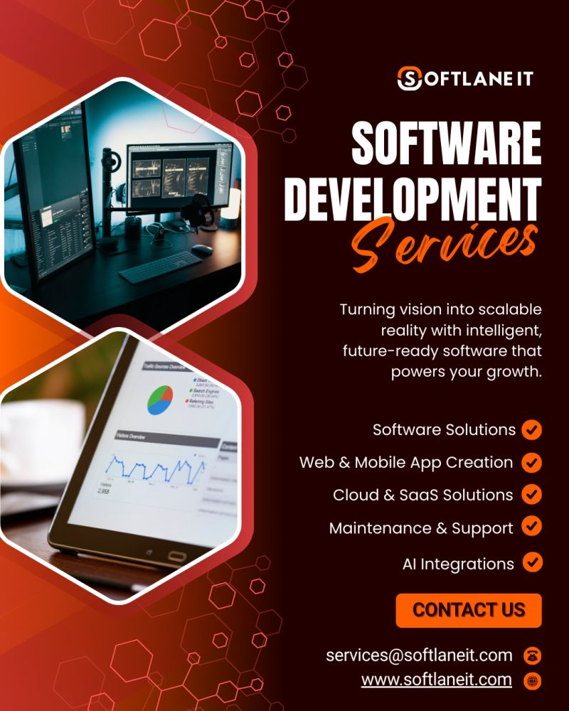

# Is your technology keeping up with your growth? 📈

**Future-ready software is no longer a luxury—it’s a necessity.** Whether you need a robust SaaS platform, a high-performance mobile app, or intelligent AI automation, **Softlane IT Pvt Ltd** is here to bridge the gap between your ideas and a functional, scalable reality.

## Why choose us?

- **End-to-end development life cycle support.**
- **Cutting-edge AI and Cloud integration.**
- **Continuous maintenance to keep you ahead.**

Partner with us today and let's build something extraordinary.

**📩 Message us for a consultation!** 
*#TechSolutions #SoftlaneIT #AppDevelopment #CloudComputing #SoftwareEngineering #BusinessGrowth #AI*

 

  
  
  
  

